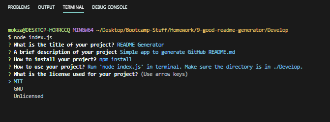
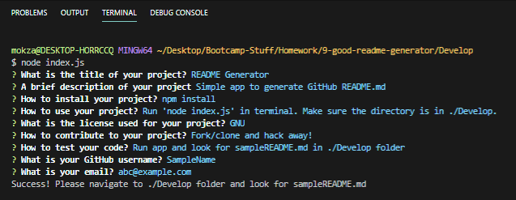
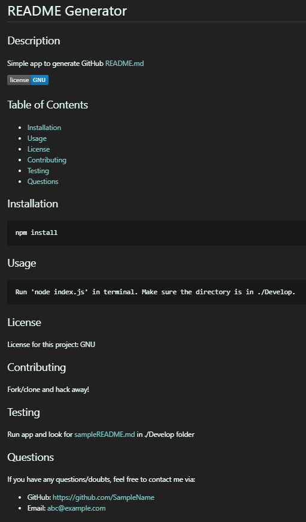
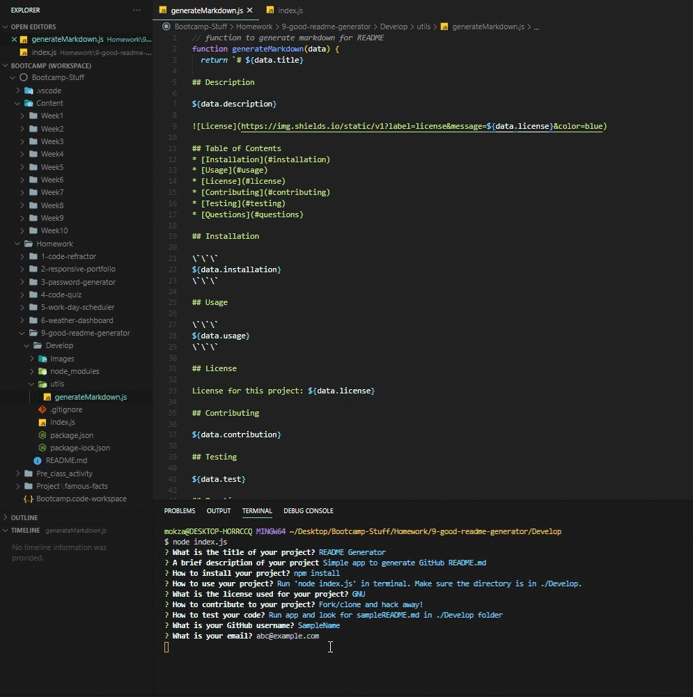

# Good README Generator

## Description

A command-line application allows quick and easy generation of a project's README.md to get started quickly. This allows users to focus more on working on their project and spend less time creating a good README.md.

[](https://www.gnu.org/licenses/gpl-3.0)

## Table of Contents
* [Installation](#installation)
* [Usage](#usage)
* [License](#license)
* [Contributing](#contributing)
* [Testing](#testing)
* [Questions](#questions)

## Installation

```
npm install
```

## Usage

* Run 'node index.js' in terminal
* Follow
* Make sure that the directory is in ./Develop

## License

License for this project: GNU GPLv3

## Contributing

1. Fork/Clone this repo
2. Hack away!
3. Create a new pull request

## Testing

Run app and look for sampleREADME.md in ./Develop folder 









## Questions

If you have any questions/doubts, feel free to contact me via:
* GitHub: [https://github.com/ZanHong](https://github.com/ZanHong)
* Email: [mokzanhong92@hotmail.com](mailto:mokzanhong92@hotmail.com)
